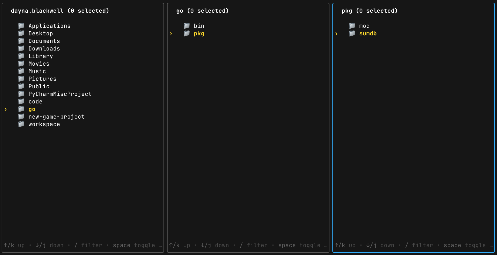
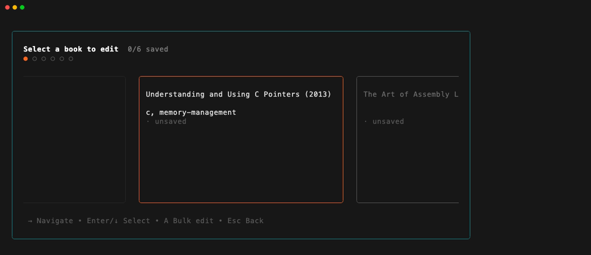

# Bubble Tea Components

Stop rewriting picker boilerplate. These components handle standard key bindings, window resizing, border rendering, and selection state — the 60-70% of every Bubble Tea picker that's always the same.

Used in production in [shelfctl](https://github.com/blackwell-systems/shelfctl), a TUI library manager built on all five components.

## Components

### Base Picker

Foundation for building picker components. Handles key bindings, window resizing, border rendering, error handling, and selection logic so you don't have to.

**Before:**

```go
func (m myPickerModel) Update(msg tea.Msg) (tea.Model, tea.Cmd) {
    switch msg := msg.(type) {
    case tea.KeyMsg:
        if m.list.FilterState() == list.Filtering {
            break
        }
        switch msg.String() {
        case "q", "esc", "ctrl+c":
            m.quitting = true
            m.err = fmt.Errorf("canceled")
            return m, tea.Quit
        case "enter":
            item := m.list.SelectedItem().(MyItem)
            m.selected = item.name
            m.quitting = true
            return m, tea.Quit
        }
    case tea.WindowSizeMsg:
        h, v := StyleBorder.GetFrameSize()
        m.list.SetSize(msg.Width-h, msg.Height-v)
    }

    var cmd tea.Cmd
    m.list, cmd = m.list.Update(msg)
    return m, cmd
}
```

**After:**

```go
func (m myPickerModel) Update(msg tea.Msg) (tea.Model, tea.Cmd) {
    cmd := m.base.Update(msg)

    if m.base.IsQuitting() && m.base.Error() == nil {
        item := m.base.SelectedItem().(MyItem)
        m.selected = item.name
    }

    return m, cmd
}
```

[Documentation →](picker/README.md)

### Multi-Select

Generic multi-selection wrapper that works with any `list.Item`. Adds checkbox UI (`[ ]` / `[✓]`) with persistent selection state across view changes — useful when navigating directories or paginated lists.

[Documentation →](multiselect/README.md)

### Miller Columns

Hierarchical navigation layout inspired by macOS Finder. Display multiple directory levels side-by-side for visual context, with keyboard-driven focus management and automatic column resizing.



[Documentation →](millercolumns/README.md)

### Carousel

Peeking single-row card layout where the active card is centered at full width and adjacent cards peek in from both sides. Supports a delegate interface for custom card content, marked-state coloring, a dot position indicator, and caller-appended footer hints.



[Documentation →](carousel/README.md)

### Command Palette

Fuzzy-search overlay over a flat list of actions — VS Code `Ctrl+P` style. Type to filter, Enter to execute, Esc to dismiss. Caller controls open/close; component handles filtering, navigation, and rendering.

[Documentation →](commandpalette/README.md)

## Installation

```bash
go get github.com/blackwell-systems/bubbletea-components
```

## Dependencies

- `github.com/charmbracelet/bubbles` - List and input components
- `github.com/charmbracelet/bubbletea` - TUI framework
- `github.com/charmbracelet/lipgloss` - Styling
- `github.com/charmbracelet/x/ansi` - ANSI-aware string width and truncation
- `github.com/sahilm/fuzzy` - Fuzzy string matching (command palette)

## Contributing

Contributions welcome! Please open an issue before starting work on major changes.

## License

MIT License - see [LICENSE](LICENSE) for details.
